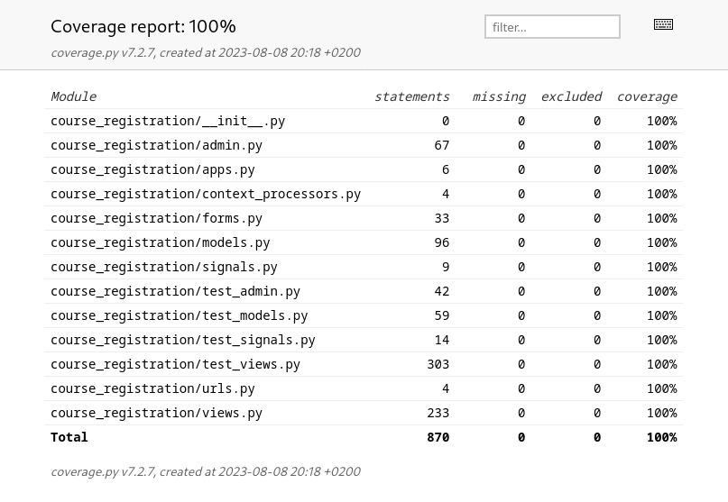
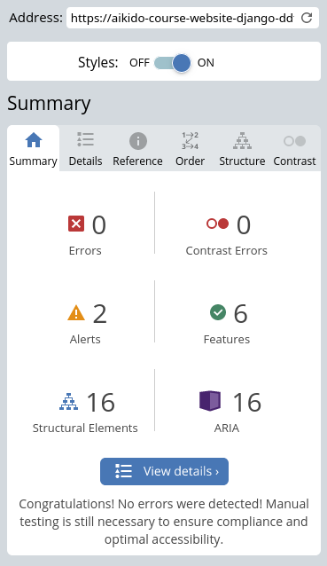

# Testing

## User Story Testing

All user stories have been tested. The results can be found here: [User Story Tests](USERSTORYS.md)

## Automated Testing

The Python and JavaScript code written for the project has been tested by writing automated unit tests and measuring code coverage. Since even 100% code coverage is no guarantee for bug-free code, thorough [manual tests](#manual-testing) have been conducted as well.

### Python Testing

All Python code written for the project has been tested by writing automated unit tests using [unittest](https://docs.python.org/3/library/unittest.html#module-unittest).
Code coverage has been measured using [Coverage.py](https://coverage.readthedocs.io/en/latest/#). Code coverage of 100% has been achieved.

The detailed test results can be found here: [Test Results Python](media/testing/unittest_results.txt)

### JavaScript Testing

All JavaScript code written for the project has been tested by writing automated tests using [Jest](https://jestjs.io/). 98% of the JavaScript code is covered by the tests.

The detailed test results can be found here: [Test Results JavaScript](media/testing/jest_results.txt)

## Manual Testing

- The website was manually tested on a variety of devices (desktop, laptop, tablet, and smartphone) and browsers. The following browsers and operating systems have been tested:
  - Linux: Firefox, Google Chrome
  - macOS: Safari
  - Microsoft Windows: Microsoft Edge
  - iOS: Safari, Firefox

- The website is working as expected in all tested browsers.
- All links, buttons, and forms were thoroughly tested to make sure they work as expected.
- Error messages (404, 403, 500) are displayed where appropriate.
- Friends and family members were asked to review the application and documentation to point out any bugs or user experience issues.

### Test user Feedback

- Several test users commented that the pagination navigation initially used for navigating between pages of the same category was confusing. So, I replaced the pagination for the PageList view with with a single page layout, where all pages are displayed on one page and navigation items link to page headers ([Commit](https://github.com/nacht-falter/aikido-course-website-django/commit/78b37ed2a61220e4143944d32ce96af525027dda))

- Also, several test users said, that they were confused by the disabled submit button in the course registration form. Since I had added some custom JavaScript to disable the submit button if required fields were not filled out, users were not able to get feedback on which fields are missing. So, some JavaScript has been added to display custom form validation messages ([Commit](https://github.com/nacht-falter/aikido-course-website-django/commit/9952002618450a99b2bab63dff36bcb602cc7ca0))

## Validators and Linters

### W3C Validators

Both HTML and CSS pass the [W3C Markup Validator](https://validator.w3.org) and [W3C CSS Validator](https://jigsaw.w3.org/css-validator/) with no errors:
- [W3C Markup Validator results](https://validator.w3.org/nu/?doc=https%3A%2F%2Faikido-course-website-django-ddffe52bc952.herokuapp.com%2F) 
- [W3C CSS Validator results](https://jigsaw.w3.org/css-validator/validator?uri=https%3A%2F%2Fres.cloudinary.com%2Fdlbwcrs5v%2Fraw%2Fupload%2Fv1%2Fstatic%2Fcss%2Fstyle.6bea1ea32948.css&profile=css3svg&usermedium=all&warning=1&vextwarning=&lang=en) (The W3C validator does not work with Bootstrap. Therefore, only the custom CSS code in style.css has been validated)

### PEP 8 Linter

All python code written for the project passes through the PEP 8 [python linter](https://pep8ci.herokuapp.com/) by Code Institute with no issues.

### Jshint

All JavaScript code was validated with the [Jshint linter](https://jshint.com/). All code passed with no errors.
 
### Chrome Lighthouse

A report on the application website generated with [Chrome Lighthouse](https://developer.chrome.com/docs/lighthouse/) showed no major issues with the performance or accessibility of the application.

[Detailed Chrome Lighthouse results](media/testing/lighthouse_results.pdf)

### WAVE

[WAVE (Web Accessibility Evaluation Tool)](https://wave.webaim.org/) was used to assess the website's accessibility. The test results showed no errors.

## Bugs

A list of the issues created for bugs encountered during devolpment can be found [here](https://github.com/nacht-falter/aikido-course-website-django/issues?q=label%3ABUG+is%3Aclosed).

| Bug | Fix |
| ----------- | ----------- |
| [Course registrations not filtered properly](https://github.com/nacht-falter/aikido-course-website-django/issues/48)  | Fix queryset filter in CourseRegistrationList view |
| [Error message after account signup](https://github.com/nacht-falter/aikido-course-website-django/issues/49) | Disable `ACCOUNT_EMAIL_REQUIRED` in settings.py as long as email backend is not configured yet |
| [Exam passed status is not displayed properly in Course Registration List](https://github.com/nacht-falter/aikido-course-website-django/issues/52) | Set filter in template explicitely to `False` |
| [Type error on CourseSession model when creating without start_date or end_date](https://github.com/nacht-falter/aikido-course-website-django/issues/53) | Check if start_time and end_time are set before calling custom clean() method on Course model |
| [Exam display breaks if brown or black belts apply for exams](https://github.com/nacht-falter/aikido-course-website-django/issues/54) | Only kyu grades can register for exams (the exam_grades list does not contain values for higher grades). Hide exam application field in form for users with higher grades. |
| [Messages are displayed on top of each other, when multiple messages are displayed](https://github.com/nacht-falter/aikido-course-website-django/issues/57) | Set `position:absolute` to message container instead of single messages |
| [Exam application with grades higher than 1st kyu cause 404 error](https://github.com/nacht-falter/aikido-course-website-django/issues/58) | Add test for user grade to RegisterCourse view before rendering the form |
| [Messages don't dissapear if there are muliple messages](https://github.com/nacht-falter/aikido-course-website-django/issues/59) | Adjust JavaScript to auto hide multiple messages instead of only the first one |
| [CRSF token error when trying to log in on iOS to deployed website](https://github.com/nacht-falter/aikido-course-website-django/issues/62) | Workaround: Clear browser cache after having logged out of the admin site (only affects staff users), more details [here](https://stackoverflow.com/questions/29612132/django-csrf-verification-failing-only-from-mobile) |
| [Users can update or cancel other users registrations by changing the key in the url](https://github.com/nacht-falter/aikido-course-website-django/issues/63) | Filter for CourseRegistration queryset for pk **and** user in view |
| [Exam passed state not updated when user confirms passed exam](https://github.com/nacht-falter/aikido-course-website-django/issues/64) | Update exam_passed field in UpdateGrade view |
| [404 error when users without user profiles try to register for courses](https://github.com/nacht-falter/aikido-course-website-django/issues/67) | Add tests if user profile exists to views, which rely on user profile data. Redirect to user profile page if no profile has been created |

## Known limitations

- It would be preferable to create forms for all staff features on the front end instead of using the Django admin site. But since the front end implementation of all essential features provided by the admin site was outside the current scope of the project, using the admin site seems to be a reasonable approach.
- So far, confirmation emails are only sent for creating an account and registering for courses. In future iterations confirmation emails should also be sent for other user actions such as deactivating the account or cancelling registrations.
- The registration status of courses has to be manually set to False from the admin site when the registration should be closed. This could be automated in the future by using some task scheduling like cronjob on the server.
- There appears to be an issue (https://github.com/nacht-falter/aikido-course-website-django/issues/62) with CSRF token validation on some mobile browsers, where CSRF token validation fails after having logged in and out of the admin site. A temporary workaround is to log out of the admin site and clear the browser cache. Since this should only affect staff users, this has been not worth fixing.  More information here: https://stackoverflow.com/questions/29612132/django-csrf-verification-failing-only-from-mobile
